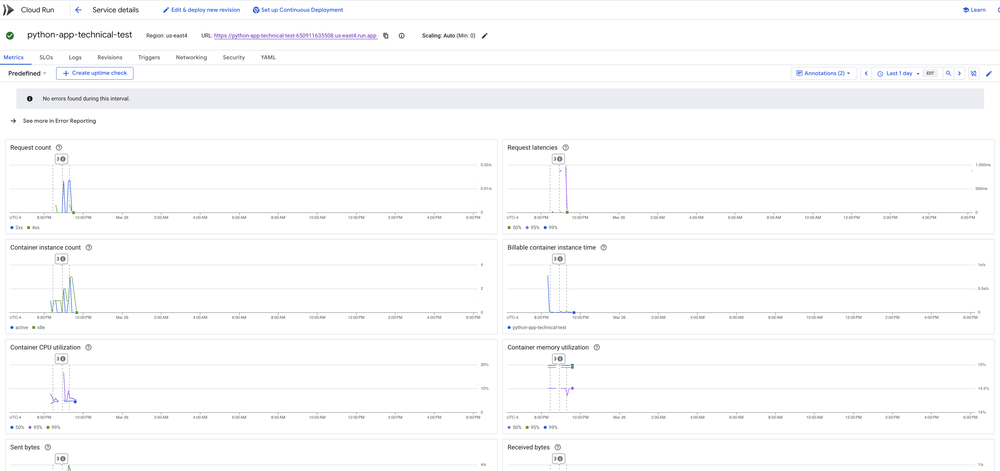

# Python Flask API on Google Cloud Run with GitHub Actions and Workload Identity Federation

This repository contains a Python Flask API designed to be deployed on Google Cloud Run. It leverages GitHub Actions and Workload Identity Federation for streamlined Continuous Integration/Continuous Deployment (CI/CD). This setup allows for automated building, pushing of Docker images, and updating the Cloud Run service directly from GitHub.

## Overview

The Flask API provides a simple web service. The CI/CD pipeline, powered by GitHub Actions and Workload Identity Federation, automates the deployment process. This ensures that any code changes pushed to the repository are automatically built, packaged into a Docker image, and deployed to Google Cloud Run.

Cloud Run URL: https://python-app-technical-test-650911635508.us-east4.run.app/feedbacks

Monitoring:
